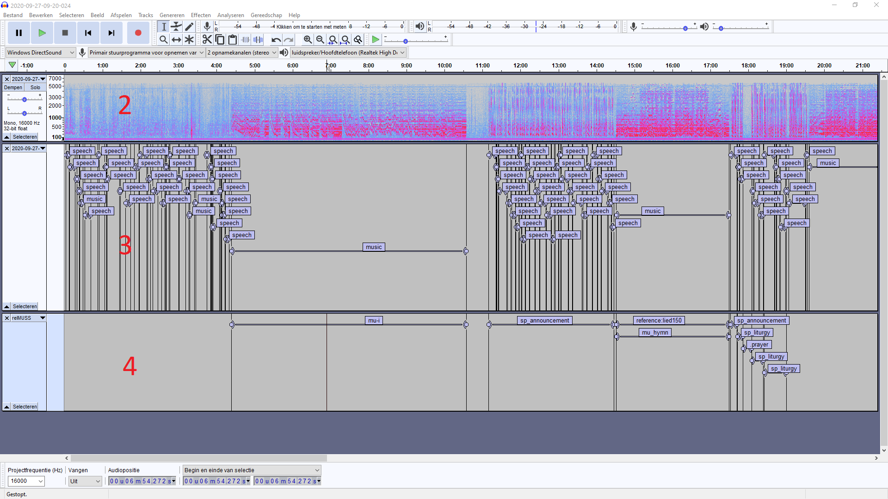

# Workflow

## Phase 1 - Initial (automatic) segmentation

1. Install [inaSpeechSegmenter](https://github.com/ina-foss/inaSpeechSegmenter) for automatic segmentation. 
2. Run `ina_speech_segmenter.py` with options `-d=smn` and `-g=false`. Results in output.csv.
3. Convert output.csv to output.txt (format: Audacity label-tracks). An example of an R-script for conversion is [added](https://github.com/ttjpleizier/relmuss-specification/blob/main/src/CSV2TXT-audacity.R).

## Phase 2 - Manual annotation in Audacity
The red numbers in the picture refer to the steps 2-4 below.

### Prepare 

1. Import audiofile (MP3) in [Audacity](https://www.audacityteam.org/): file > import > audio.[^macos]
2. Set view of the audio-track to Spectrogram and select spectrogram scale MEL. Use dropdown menu next in the leftbox of the wave-form: spectrogram > spectrogram settings > scale > MEL.[^stereo]
3. Import the label file generated by inaSpeechSegmenter and that has been converted to output.txt to guide manual labelling: file > import > labels.

### Tag segments 
4. Add new label track for the relMUSS annotation: tracks > add > labeltrack.
5. Find the first segment with music or speech that indicates the start of the worship service and label the segments in the new label track accordingly. 

Suggestions: use the Speech-segmenter track to select a segment, and press CTRL(CMD)-B to create a new label in the relMUSS track. Drag the borders of the segment to match its required length.

### Export label-track to .txt
6. Remove the Speech Segmenter track to make sure only the relMUSS track with newly annotated segments is visible in Audacity. 
7. Export label-track: file > export > export labels

[^macos]: For macOS open Audacity in low resolution; select 'low resulation' in the 'display info' of the application.
[^stereo]: In case the audio file consists of two tracks (stereo): use the same dropdown menu and select 'split stereo/mono' and remove one of the tracks from the view.
